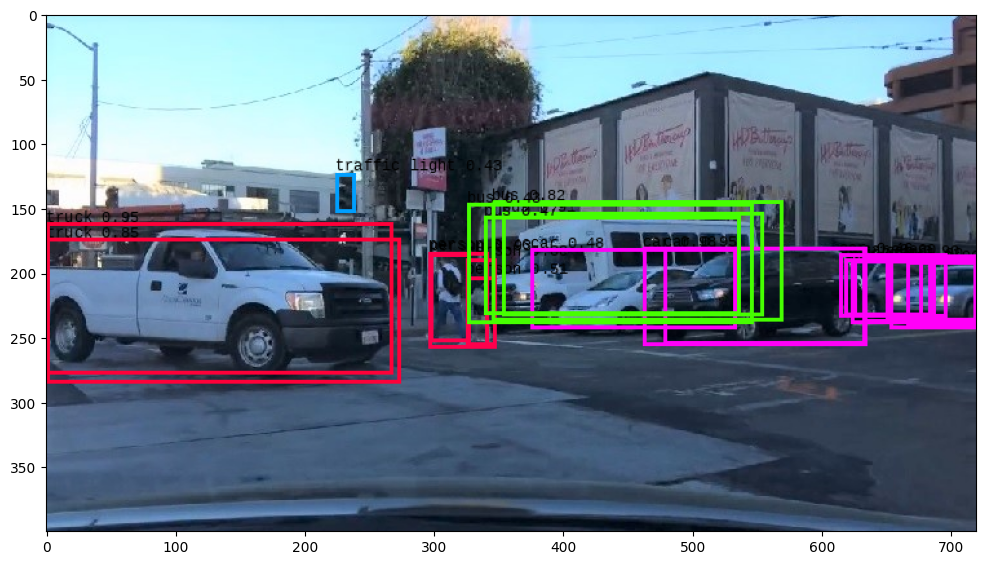
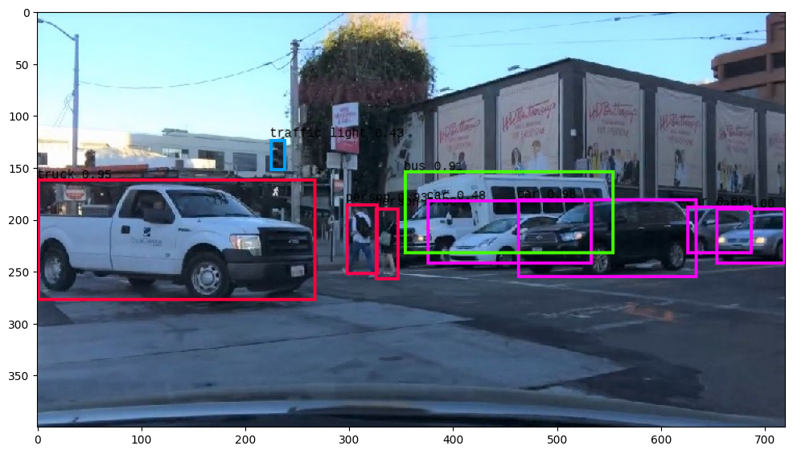
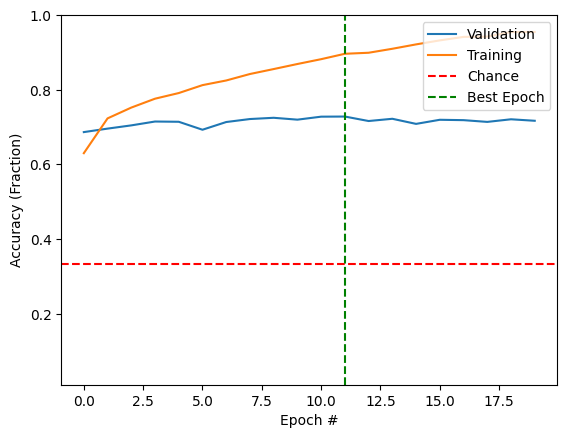
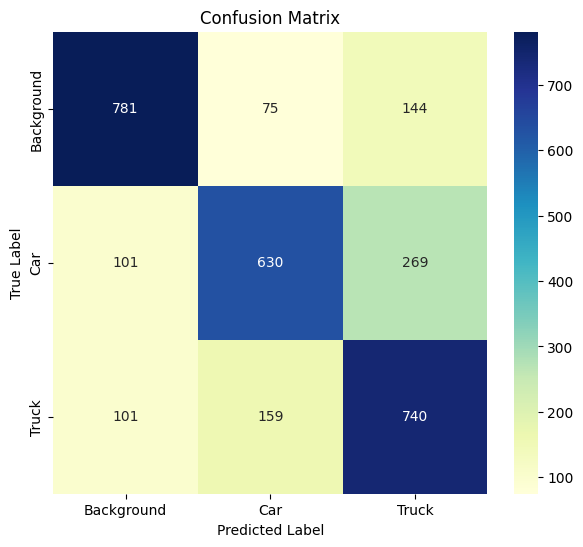

# Object Detection for Self-Driving Cars

[](https://github.com/MMahmoud27/self-driving-object-detection/actions/workflows/tests.yml)

Road-scene object detection, built up from a classifier that can barely tell a
car from a truck to YOLOv3 labelling every vehicle, pedestrian and traffic light
in a dashcam video.

Each stage exists to expose the limitation that motivates the next one:

| Stage | Approach | What it fixed | What it couldn't do |
|---|---|---|---|
| 1 | Perceptron on 32×32 crops | Classifies `background` / `car` / `truck` | Flattening throws away spatial structure — **70% test accuracy** |
| 2 | CNN + sliding window | Convolutions keep spatial structure; sliding windows add *where* | One forward pass per window; boxes snap to a grid — **85%** |
| 3 | VGG16 transfer learning | ImageNet features beat learning from scratch on 15k images — **95%** | Still a classifier bolted onto a brute-force scan |
| 4 | YOLOv3 | One pass over the whole image, 80 classes, real boxes at 3 scales | No frame-to-frame tracking |

<p align="center">
  
  
</p>
<p align="center"><em>YOLOv3 raw output (22 candidate boxes) → after non-maximal suppression (9 detections).</em></p>

📹 **[`VideoResult.mp4`](VideoResult.mp4)** — the detector run frame by frame over a 301-frame dashcam clip.

---

## Quickstart

```bash
git clone https://github.com/MMahmoud27/self-driving-object-detection.git
cd self-driving-object-detection
pip install -r requirements.txt
```

Fetch the YOLOv3 weights and convert them for Keras (237 MB, one-off):

```bash
python scripts/download_assets.py
```

Detect objects in an image or a video:

```bash
python scripts/detect.py street.jpg --output outputs/street.png
```

```bash
python scripts/detect.py dashcam.mp4 --output outputs/dashcam.mp4
```

Train a vehicle classifier from scratch:

```bash
python scripts/train_classifier.py --model cnn --epochs 20
```

Launch the web app:

```bash
streamlit run app/app.py
```

Upload a road scene and it comes back annotated, with sliders for the objectness
and NMS thresholds so you can watch the precision/recall trade-off directly.

---

## Results

### Vehicle classifier — 3 classes, 15,000 train / 3,000 test images

| Model | Epochs | Train accuracy | Test accuracy |
|---|---|---|---|
| Perceptron — `Flatten → Dense(128) → Dense(3)` | 10 | 88.4% | 70.2% |
| Perceptron | 20 | 96.5% | 70.9% |
| CNN — `Conv2D(32) → ReLU → MaxPool → Dense(128) → Dense(3)` | 20 | 100% | **84.7%** |
| VGG16 transfer — ImageNet backbone + custom head | 20 | 99.8% | **94.6%** |

Chance is 33.3% — the dataset is balanced by construction.

<p align="center">
  
  
</p>

Two things stand out. **The models overfit hard**: the perceptron's training
accuracy climbs past 96% while validation sits flat at ~71% from epoch 3
onwards, and the CNN reaches a perfect 100% on training data. Every run
therefore checkpoints on best validation loss rather than keeping the last
epoch.

**Cars and trucks are what get confused.** From the perceptron's confusion
matrix, 269 of 1,000 cars were called trucks and 159 of 1,000 trucks were called
cars, while background was the easiest class by a wide margin. At 32×32 pixels a
hatchback and a pickup really do look alike; that ambiguity is what the deeper
models buy their way out of.

### YOLOv3

On a 720×400 street scene, YOLOv3 produced 22 candidate boxes above the 0.4
objectness threshold, which NMS reduced to 9 detections: 4 cars, 2 people, 1
bus, 1 truck and 1 traffic light. Full numbers in [docs/RESULTS.md](docs/RESULTS.md).

---

## How it works

### The dataset

CIFAR-10 has ten classes; only two are vehicles worth detecting. This project
keeps `automobile` and `truck`, and folds the other eight into a single
`background` class so the model learns "not a vehicle" as an explicit answer
rather than being forced to guess. 5,000 images per class for training, 1,000
for test — balanced, so accuracy is directly interpretable against a 33.3%
chance baseline.

### Sliding windows

A classifier answers *what is this?*; detection also needs *where is it?*. The
cheapest bridge is to slide a fixed 32×32 window across the image in 16px steps
— overlapping, so an object straddling a grid line still lands fully inside at
least one crop — and classify every crop. It works, and it is slow, size-locked
and grid-snapped. Those three limits are exactly what YOLO removes.

### YOLOv3

One network pass over the whole image produces detections at three scales
(13×13, 26×26 and 52×52 grids), so a lorry filling the frame and a distant
traffic light are both findable. Each grid cell predicts 3 boxes; each box
carries 4 geometry values, 1 objectness score and 80 class scores — which is why
the output tensors are 255 deep.

The weights ship as a Darknet `.weights` file: a short header and a flat stream
of float32 values, with no architecture and no layer names. `roadvision.darknet`
rebuilds the 75-convolution graph in Keras and reads the stream back in the same
order Darknet wrote it, so the project depends only on the canonical weights
release.

Two thresholds control the output:

- **`obj_thresh`** (default 0.4) — how sure the model must be before a box
  counts at all. Raise it to cut false positives, lower it to catch faint
  objects.
- **`nms_thresh`** (default 0.45) — how much two boxes may overlap before the
  weaker one is discarded. This is what turns the 22 raw boxes above into 9.

---

## Repository layout

```
├── src/roadvision/
│   ├── data.py             CIFAR-10 → 3-class vehicle dataset, normalisation
│   ├── models.py           Perceptron, CNN, transfer-learning builders
│   ├── sliding_window.py   Window extraction and classification
│   ├── darknet.py          YOLOv3 architecture + Darknet weight loader
│   ├── yolo.py             Pre/post-processing, image and video detection
│   └── viz.py              Accuracy curves, confusion matrices
├── app/app.py              Streamlit front end
├── scripts/
│   ├── download_assets.py  Fetch and convert the YOLOv3 weights
│   ├── detect.py           Run detection on an image or video
│   └── train_classifier.py Train and evaluate a vehicle classifier
├── tests/                  42 tests, no GPU or weights required
└── docs/                   Detailed results and figures
```

---

## Tests

```bash
pytest
```

**53 tests run in under a second** with no TensorFlow, no GPU and no weights
file, covering box geometry, non-maximal suppression, window extraction,
letterboxing, output decoding and dataset construction. Decoding is driven by a
synthetic feature map rather than a real forward pass, which is what keeps them
fast enough to run in CI on every push.

Install TensorFlow and a further 16 tests unskip, covering model construction
and the weight loader:

```bash
pip install -r requirements-dev.txt && pytest
```

Two of those are worth calling out, because together they verify the Darknet
conversion without downloading anything:

- The assembled graph has **exactly 62,001,757 parameters**, matching the
  published network. One wrong filter count anywhere and this fails.
- ×4 bytes plus the 20-byte header, that is **248,007,048 — byte-for-byte the
  size of the official `yolov3.weights`**. The loader is then run against a
  synthetic file of that exact shape and must consume every value with none
  left over, which pins the architecture, the header parsing and the read order
  all at once.

---

## Limitations

- **Frames are independent.** Video detection runs YOLO on each frame with no
  tracking between them, so boxes can flicker and an object briefly occluded is
  lost and re-found.
- **The custom classifier is trained at 32×32.** That resolution is why cars and
  trucks blur together; it was chosen to keep training fast, not because it's
  right for road scenes.
- **YOLOv3 is used as pretrained on COCO, not fine-tuned.** It has never seen
  this project's data. It is also a 2018 model — YOLOv8/v11 are considerably
  faster and more accurate.
- **No detection metrics.** Everything reported is classification accuracy or
  eyeballed boxes. Proper evaluation would need mAP against ground-truth
  bounding boxes.
- **Not remotely road-safe.** Real autonomous vehicles fuse camera, LiDAR and
  radar, and treat a missed detection as a safety event rather than a percentage
  point.

---

## References

- YOLOv3 — Redmon & Farhadi, [*YOLOv3: An Incremental Improvement*](https://arxiv.org/abs/1804.02767); original paper [*You Only Look Once*](https://arxiv.org/abs/1506.02640)
- VGG16 — Simonyan & Zisserman, [*Very Deep Convolutional Networks*](https://arxiv.org/abs/1409.1556)
- [CIFAR-10](https://www.cs.toronto.edu/~kriz/cifar.html) — Krizhevsky, University of Toronto
- Pretrained backbones via [Keras Applications](https://keras.io/api/applications/); each carries its own upstream licence

---

## License

MIT — see [LICENSE](LICENSE). The pretrained YOLOv3 weights and the ImageNet
backbones carry their own upstream terms.
